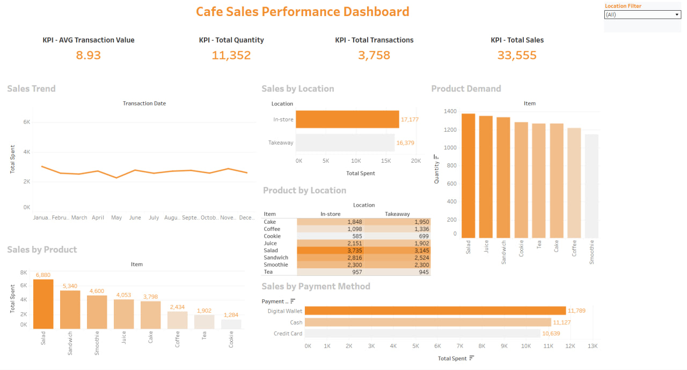

# Cafe Sales Data Cleaning & Exploratory Data Analysis

## Project Overview

This project focuses on cleaning, validating, and analyzing a cafe sales dataset using SQL and MySQL.

The goal was to identify data quality issues, standardize invalid values, validate the cleaned dataset, and extract meaningful business insights through exploratory data analysis.

## Tools

- MySQL
- MySQL Workbench
- SQL

## Dataset

The dataset contains 10,000 cafe transaction records from 2023.

The main columns include:

- Transaction ID
- Item
- Quantity
- Price Per Unit
- Total Spent
- Payment Method
- Location
- Transaction Date

## Data Preparation

A separate working table was created from the original dataset so that the raw data remained unchanged during the cleaning process.

## Data Cleaning

The following data quality issues were investigated and handled:

- UNKNOWN values
- ERROR values
- Blank values
- Missing values

Invalid placeholder values were standardized to SQL NULL where appropriate.

Transaction Date values containing ERROR, UNKNOWN, or blank values were converted to NULL.

Invalid Total Spent values were recalculated using:

Quantity × Price Per Unit

Missing Location values were kept as NULL because no reliable relationship was identified that could be used to infer the missing values.

## Data Validation

The cleaned dataset was validated through multiple checks, including:

- Duplicate record detection
- Transaction ID uniqueness
- Missing Transaction ID values
- Transaction Date validation
- Transaction Date range
- Transaction Date completeness
- Quantity range validation
- Price validation
- Total Spent validation
- NULL value checks

### Validation Results

- No duplicate records were identified.
- Transaction IDs were unique.
- No missing or invalid Transaction IDs were found.
- Quantity values were within the expected range of 1–5.
- No zero or negative Price Per Unit values were found.
- No zero or negative Total Spent values were found.
- Total Spent values were consistent with Quantity × Price Per Unit after cleaning.
- Valid transaction dates ranged from January 1, 2023 to December 31, 2023.
- All 365 days of 2023 were represented in the dataset.

## Exploratory Data Analysis

The EDA focused on:

- Transaction volume
- Product performance
- Payment method performance
- Location performance
- Monthly sales trends
- Monthly transaction volume
- Average transaction value

## Key Findings

### Product Performance

- Juice was the most frequently purchased product, appearing in 1,063 transactions.
- Tea was the least frequently purchased product, appearing in 972 transactions.
- Salad generated the highest total sales at 15,600.
- Coffee had the highest number of units sold with 3,212 units.
- Salad had the highest average transaction value at approximately 15.15.

### Payment Methods

- Digital Wallet was the most frequently used payment method with 2,068 transactions.
- Digital Wallet generated the highest total sales at 18,530.
- Cash generated 18,486 in total sales.
- Credit Card generated 18,441 in total sales.

The differences in sales between payment methods were relatively small.

### Location Performance

In-store performed slightly better than Takeaway:

| Location | Transactions | Total Sales | Average Transaction Value |
|----------|--------------|-------------|---------------------------|
| In-store | 2,731 | 24,598 | 9.01 |
| Takeaway | 2,711 | 23,868 | 8.80 |

Despite having a similar number of transactions, In-store generated higher total sales because its average transaction value was slightly higher.

### Monthly Performance

- June had the highest monthly sales at 6,678.
- February had the lowest monthly sales at 6,055.
- March had the highest transaction volume with 749 transactions.
- February had the lowest transaction volume with 660 transactions.
- April had the highest average transaction value at 9.28.
- March had the lowest average transaction value at 8.65.

Overall, monthly sales and average transaction value remained relatively stable throughout 2023.

## Business Insights

1.Salad was the strongest revenue-generating product and had the highest average transaction value.

2. Juice was the most frequently purchased product, showing that purchase frequency does not necessarily correspond to the highest revenue.

3. Coffee had the highest number of units sold but did not generate the highest revenue, highlighting the difference between sales volume and revenue.

4. In-store generated more revenue than Takeaway despite having almost the same number of transactions.

5. Digital Wallet was the most commonly used payment method and generated the highest total sales, although the difference between payment methods was relatively small.

6. Monthly performance was relatively stable throughout the year, with no major extreme fluctuations.

## SQL Analysis

All SQL queries used for data profiling, cleaning, validation, and exploratory data analysis are available in:

cafe_sales_analysis.sql

## Dataset File

The original dataset used in this project is available in:

cafe_sales.csv

## Conclusion

This project demonstrates a complete SQL data analysis workflow, starting with data preparation and profiling, followed by data cleaning and validation, and ending with exploratory data analysis and business insights.

The project demonstrates practical SQL skills including filtering, aggregation, grouping, window functions, CTEs, data cleaning, validation, and analytical querying.

## Tableau Dashboard

The cleaned cafe sales data was visualized using Tableau Public to create an interactive dashboard covering sales trends, product performance, location, and payment methods.
[View Interactive Tableau Dashboard]([https://public.tableau.com/app/profile/mohab.adel/viz/CafeSalesPerformanceDashboard_17876794531280/Dashboard1?publish=yes](https://public.tableau.com/app/profile/mohab.adel/viz/CafeSalesPerformanceDashboard_17876794531280/Dashboard1?publish=yes))

